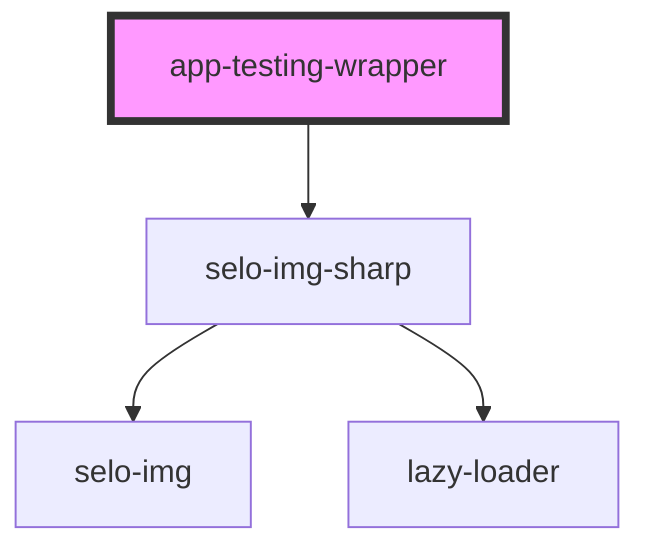

# app-testing-wrapper

<!-- Auto Generated Below -->

## Properties

| Property  | Attribute | Description | Type                          | Default                                           |
| --------- | --------- | ----------- | ----------------------------- | ------------------------------------------------- |
| `alt`     | `alt`     |             | `string`                      | `'Logo Name'`                                     |
| `loading` | `loading` |             | `"auto" \| "eager" \| "lazy"` | `undefined`                                       |
| `src`     | `src`     |             | `string`                      | `'assets/images/2020/01/apple-iphone-xs-new.jpg'` |

## Dependencies

### Depends on

- [selo-img-sharp](../selo-img-sharp)

### Graph

----------------------------------------------

*Built with [StencilJS](https://stenciljs.com/)*
