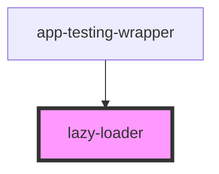

# lazy-loader

<!-- Auto Generated Below -->

## Events

| Event                      | Description                                         | Type                |
| -------------------------- | --------------------------------------------------- | ------------------- |
| `lazyLoaderDidDissconnect` | Emitted when the LazyLoader fails to load           | `CustomEvent<void>` |
| `lazyLoaderDidLoad`        | Emitted when the LazyLoader has finished loading    | `CustomEvent<void>` |
| `lazyLoaderOnSlotChange`   | Emitted when the LazyLoader fails to load           | `CustomEvent<void>` |
| `lazyLoaderWillLoad`       | Emitted when the Lazyloader shouldLoad has been set | `CustomEvent<void>` |

## Dependencies

### Used by

 - [app-testing-wrapper](../app-testing-wrapper)

### Graph

----------------------------------------------

*Built with [StencilJS](https://stenciljs.com/)*
