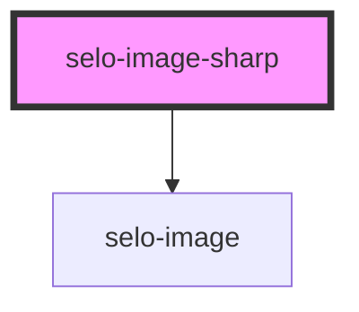

# selo-image-sharp

<!-- Auto Generated Below -->

## Properties

| Property          | Attribute | Description | Type                  | Default                                                                                                                         |
| ----------------- | --------- | ----------- | --------------------- | ------------------------------------------------------------------------------------------------------------------------------- |
| `imageAttributes` | --        |             | `HTMLImageAttributes` | `{     src: 'assets/images/lucas-benjamin-wQLAGv4_OYs-unsplash.jpg',     alt: 'unsplash',     width: 400,     height: 400,   }` |
| `options`         | `options` |             | `any`                 | `Build.isBrowser     ? {}     : imageOptions`                                                                                   |

## Dependencies

### Depends on

- [selo-image](../selo-image)

### Graph

----------------------------------------------

*Built with [StencilJS](https://stenciljs.com/)*
