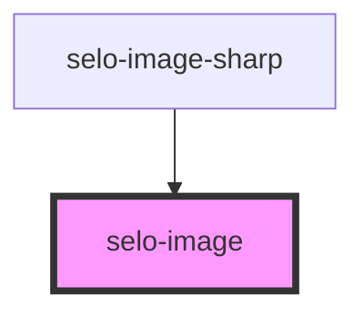

# selo-image

<!-- Auto Generated Below -->

## Properties

| Property | Attribute | Description | Type     | Default     |
| -------- | --------- | ----------- | -------- | ----------- |
| `alt`    | `alt`     |             | `string` | `undefined` |
| `src`    | `src`     |             | `string` | `undefined` |

## Events

| Event            | Description                                 | Type                |
| ---------------- | ------------------------------------------- | ------------------- |
| `ionError`       | Emitted when the img fails to load          | `CustomEvent<void>` |
| `ionImgDidLoad`  | Emitted when the image has finished loading | `CustomEvent<void>` |
| `ionImgWillLoad` | Emitted when the img src has been set       | `CustomEvent<void>` |

## Shadow Parts

| Part      | Description |
| --------- | ----------- |
| `"image"` |             |

## Dependencies

### Used by

 - [selo-image-sharp](../selo-image-sharp)

### Graph

----------------------------------------------

*Built with [StencilJS](https://stenciljs.com/)*
