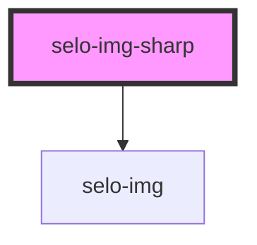

# selo-img-sharp

<!-- Auto Generated Below -->

## Properties

| Property  | Attribute | Description | Type  | Default        |
| --------- | --------- | ----------- | ----- | -------------- |
| `options` | `options` |             | `any` | `imageOptions` |

## Dependencies

### Depends on

- [selo-img](../selo-img)

### Graph

----------------------------------------------

*Built with [StencilJS](https://stenciljs.com/)*
