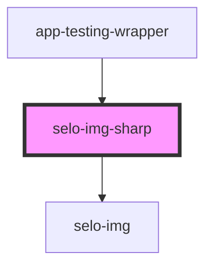

# selo-img-sharp

<!-- Auto Generated Below -->

## Properties

| Property         | Attribute        | Description | Type                          | Default                        |
| ---------------- | ---------------- | ----------- | ----------------------------- | ------------------------------ |
| `alt`            | `alt`            |             | `string`                      | `undefined`                    |
| `loading`        | `loading`        |             | `"auto" \| "eager" \| "lazy"` | `undefined`                    |
| `nativeLoading`  | `native-loading` |             | `boolean`                     | `undefined`                    |
| `options`        | --               |             | `ImageOptions`                | `undefined`                    |
| `shouldLoad`     | `should-load`    |             | `boolean`                     | `undefined`                    |
| `sourceMetadata` | --               |             | `SourceMetadata`              | `undefined`                    |
| `src`            | `src`            |             | `string`                      | `'/assets/images/NEWLOGO.png'` |

## Dependencies

### Used by

 - [app-testing-wrapper](../app-testing-wrapper)

### Depends on

- [selo-img](../selo-img)

### Graph

----------------------------------------------

*Built with [StencilJS](https://stenciljs.com/)*
