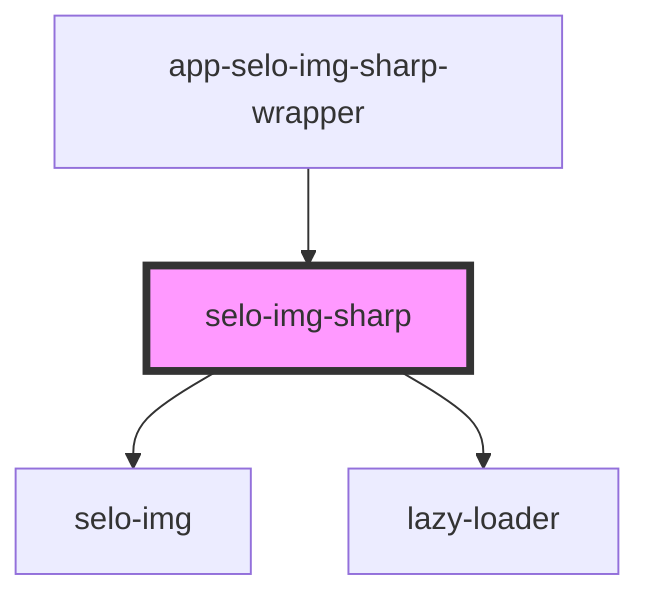

# selo-img-sharp

<!-- Auto Generated Below -->

## Properties

| Property  | Attribute | Description | Type                          | Default     |
| --------- | --------- | ----------- | ----------------------------- | ----------- |
| `alt`     | `alt`     |             | `string`                      | `undefined` |
| `loading` | `loading` |             | `"auto" \| "eager" \| "lazy"` | `'lazy'`    |
| `options` | --        |             | `ImageOptions`                | `undefined` |
| `src`     | `src`     |             | `string`                      | `undefined` |

## Dependencies

### Used by

 - [app-selo-img-sharp-wrapper](../app-selo-img-sharp-wrapper)

### Depends on

- [selo-img](../selo-img)
- [lazy-loader](../lazy-loader)

### Graph

----------------------------------------------

*Built with [StencilJS](https://stenciljs.com/)*
