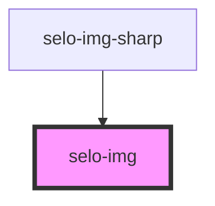

# selo-img

<!-- Auto Generated Below -->

## Properties

| Property  | Attribute | Description | Type                          | Default     |
| --------- | --------- | ----------- | ----------------------------- | ----------- |
| `alt`     | `alt`     |             | `string`                      | `undefined` |
| `loading` | `loading` |             | `"auto" \| "eager" \| "lazy"` | `undefined` |
| `sizes`   | `sizes`   |             | `string`                      | `undefined` |
| `sources` | --        |             | `Source[]`                    | `undefined` |
| `src`     | `src`     |             | `string`                      | `undefined` |
| `srcset`  | `srcset`  |             | `string`                      | `undefined` |
| `type`    | `type`    |             | `string`                      | `undefined` |

## Events

| Event         | Description                                 | Type                |
| ------------- | ------------------------------------------- | ------------------- |
| `imgDidLoad`  | Emitted when the image has finished loading | `CustomEvent<void>` |
| `imgError`    | Emitted when the img fails to load          | `CustomEvent<void>` |
| `imgWillLoad` | Emitted when the img src has been set       | `CustomEvent<void>` |

## Shadow Parts

| Part      | Description              |
| --------- | ------------------------ |
| `"image"` | The inner `img` element. |

## Dependencies

### Used by

 - [selo-img-sharp](../selo-img-sharp)

### Graph

----------------------------------------------

*Built with [StencilJS](https://stenciljs.com/)*
